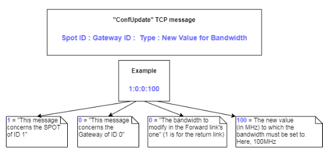
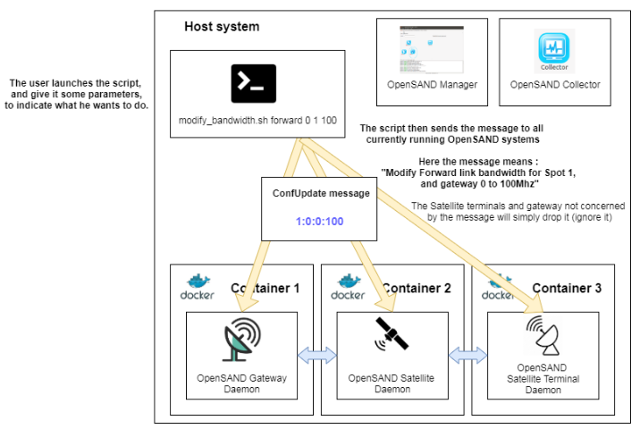
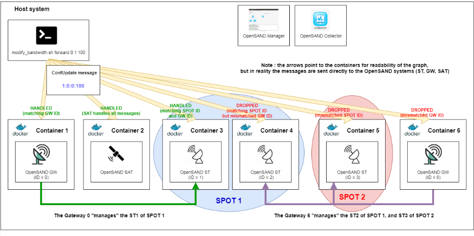
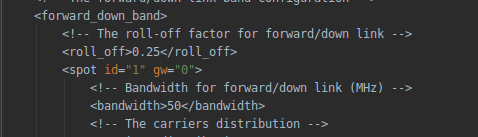
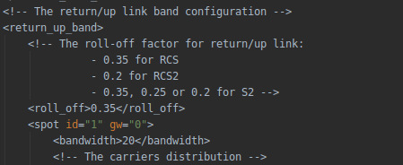
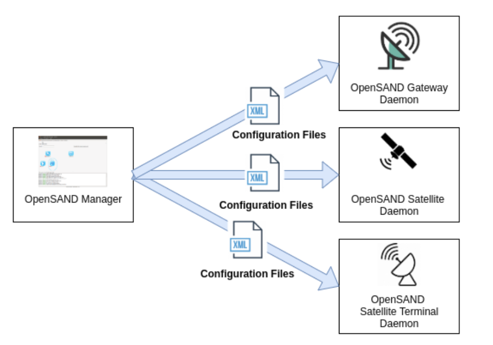

## Brief Repository Description
This repository is a Fork of Opensand 5.1.2 , made for a student project at ENSEEIHT.

This project was developed in early 2020 to allow for in-simulation bandwidth modification (i.e. modification of the bandwidth while the satellite link simulation is running), for both forward and return links.

The feature was briefly tested, and seems to do the job in most cases, but it should NOT be considered as a production-worthy development, as it needs more extensive testing and peer-reviewing.

Most of the code (as well as most of the git history) is imported from Opensand Repository , available at https://forge.net4sat.org/opensand/opensand

## OpenSAND brief presentation

> *Description coming from OpenSAND's [original README](https://forge.net4sat.org/opensand/opensand)*

OpenSAND is an user-friendly and efficient tool to emulate satellite
communication systems, mainly DVB-RCS - DVB-S2.

It provides a suitable and simple means for performance evaluation and
innovative access and network techniques validation. Its ability to interconnect
real equipments with real applications provides excellent demonstration means.

The source codes of OpenSAND components is distributed "as is" under the terms
and conditions of the GNU GPLv3 license or the GNU LGPLv3 license.

The original project source and website can be visited at [opensand.org](https://opensand.org)

The opensand repository is available [here](https://forge.net4sat.org/opensand/opensand).

## How to use my work
This repository contains the complete sources of OpenSAND, imported from OpenSAND master branch, as well as my modifications/additions made on it.

To use it, simply download the whole repository, or clone it.

Then, you'll need to compile the sources, a method can be found on the [OpenSAND wiki,](https://wiki.net4sat.org/doku.php?id=opensand:manuals:compilation_manual:index) but you can also use my scripts to do so (I recommend to use them for simplicity's sake). See below for how to use my compilation scripts.

Once you have compiled the sources, you should have various .deb packages.
You can install them directly using you preferred packet manager (such as apt).

##  Compilation using my scripts
### Summary
My custom-made compilation scripts are available on the repository, inside the folder "compilation-scripts".

They are decomposed various bash scripts which allow for a somewhat pain-free compilation of openSAND.

I used these scripts during this project development to ease compilation and deployment, so they should do the job for you.

*(detailed description and re-testing of scripts to be done and redacted here)*

### Package the source files
First of all, you'll need to package the sources into an archive.

A script in provided to do so easily. 
Go into the "compilation-scripts" folder, and run it : 

    cd compilation-scripts
    ./packageSources.sh

### Compile my modified version of OpenSAND using the packages archive
Then, you'll need to compile my modified version of OpenSAND on your system.

To do so, I'm providing the script "cleanAndRecompileAll". 
This script does the following operations : 

 - It **uninstalls all versions of OpenSAND present on your system** (as some OpenSAND packages need to be compiled and installed before the  rest of the compilation can be done, and having other versions of OpenSAND may create issues during the compilation)  
   
  - Then, it **installs the packages required to compile** OpenSAND.
 - It copies opensand sources to **/tmp/opensand_installer_dir** (to avoid read/write rights issues).
 - Then it **compiles OpenSAND** from this folder.
 - Finally, it copies the **built packages** it to a new folder ***./opensand-compiled-packages***.

To run it, simply type : 

    ./cleanAndRecompileAll.sh
  
  
  If any error occurs, you should check the logs in your terminal, to see where the issue comes from.
  
  
  If you want to check the compilation logs, you can find them in  : 
  **/tmp/workspace/src/<module_name>/build.log** (for build errors) 
  and **/tmp/workspace/src/<module_name>/config.log** (for configuration errors)

The whole compilation process can take several minutes (around 10 in my computer), so be patient.

If everything went fine, you should have a final output that looks like : 

*Every OpenSand package was built successfully.*

You should now have the OpenSAND compiled packages in the folder "opensand-compiled-packages".

  
*The resulting compiled packages.*

Those packages can then be used to install OpenSAND on any system.

If you want an easy way to test and deploy OpenSAND on Docker Containers, I recommand the work of my colleague Martin Frisch (to which I contributed), [OpenSAND-Docker](https://github.com/neuaa/opensand-docker).

# Work Technical Description

## High-Level view of our modifications to OpenSAND

  

The work we did on OpenSand consisted in allowing the update of the forward and return links bandwidth, while a simulation was running.

  

To do so, we implemented some modifications in the OpenSAND code, to make Gateways, Satellites terminals and Satellites listen for TCP messages in a specific port.

  

These messages allow a user to request for a bandwidth update, during a simulation.

  

The format for those messages is the following :

As you can see in the image above, requests are composed of 4 fields, separated by ":", that indicate the needed information for a bandwidth update :

-   The first field indicates the **ID of the Spot** for which the bandwidth must be updated
    
-   The second is the **ID of the Gateway**
    
-   The third indicates the **type of the request** (0 for an update of the Forward bandwidth, 1 for the Return).
    
-   The fourth field indicates the **new value of the bandwidth** (in MHz).
    

  

Those messages must be sent to all the systems (GWs, STs, SAT) related to the request, in order to keep the simulation coherent.

  

In order to ease this "message-sending", we wrote a shell script that sends those messages to all currently running systems, so that the bandwidth can be correctly updated.

The general principle of this script can be seen in the image below.

*An example of usage of the modify_bandwidth.sh script*

  

When a bandwidth update is received by a system (ST, GW, SAT), it is analysed, in order to determine if the message concerns the system or not :

-   a **SAT handles all messages** received,
    
-   a **GW handles only** ones with a **GW_ID matching** its own.
    
-   a **ST handles only** the ones with a **SPOT_ID matching** the SPOT the ST is in, and whose GW_ID matches the ID of the Gateway linked to it (to the considered ST).
    
-  ** In all other cases, the message is dropped (ignored).**
    

  

This behavior is illustrated with the example below.

*An example of how the requests are handled by the different systems.*

  

If the message is related to the system, it performs the following operations, in order to update the forward/return link bandwidth :

-   The system updates the value of the bandwidth (and the symbol rate) in its configuration file (located at */etc/opensand/core_global.conf* ).
    
    
-   Then the system is partially reloaded, so that the modifications made in the configuration file can be applied.

The system then continues to work as usual afterwards.

## Detailed implementation of the bandwidth update

  

As said in the "high-level view" of our implementation, two main operations must be performed when a bandwidth update request is received by a system :

-   **Update the configuration file** with the new value for the bandwidth
    
-   **Reset part of the system** so that the new value can be used for the current simulation, without interrupting it.
    

  

We will detail how we implemented these two operations in the following part of this document.

  

### Update of the core_global.conf configuration file

  

The bandwidth parameter is described in the core_global.conf file, located in /etc/opensand.

  

More precisely, the lines that describe the forward bandwidth are the following :

  

And the ones describing the Return bandwidth are :

  

Knowing that, we wrote C++ functions (*modifyForwardBandwidthAndSymbolRateInGlobalConf* and *modifyReturnBandwidthAndSymbolRateInGlobalConf*) to update these two parts of the configuration file.

These functions are implemented in the *ConfUpdateXMLParser.cpp* file, located in the *opensand-core/src/conf* folder.

  

These two functions parse the XML configuration file to look for the field containing the bandwidth, and update its value to the new value contained in the received Bandwidth update Request.

  

The symbol rate associated with this bandwidth is also updated, using the formula :

    double symbol_rate_new_val = (newValue / oldValueForBandwidth) * old_symbol_rate_val;
with **newValue** beeing the new value for the bandwidth contained in the request.

That way, if the bandwidth is doubled, the symbol rate is doubled and so on.
  

#### Why updating the symbol rate ?

Our tests have shown that updating the bandwidth without updating the symbol rate caused the number of carriers for the link to be updated, instead of the width of the currently existing carriers.

  

This behavior was due to how the bandwidth computation is implemented in OpenSAND (more precisely, how the bandwidth parameter loaded from the configuration file is used in the initBand and the computeBandwidth functions in the DvbChannel class).

This behavior was not the one expected by our supervisor, and that's why we decided to update the symbol rate, as a workaround.

  

## Resetting part of the system

### Why do we need to reset each system ?

In a typical OpenSAND use, you use the OpenSAND manager (the GUI) to configure various parameters of your simulation.

This modifies various configuration files of the machine that runs the manager.

When you start the simulation, these configuration files are then deployed on each of the "Daemon Machines" (see image below).

The OpenSAND Daemons then starts each of the systems processes (STs, GWs, SAT…) by launching their executable.

OpenSAND configuration files are then read, and an image of their content is saved in memory (as a DomParser).

This means that the simulation parameters stored in the configuration file are loaded once when the simulation starts, and they are not re-read afterwards.
  
  

This is the reason why we chose to partially reset each system when a bandwidth update request is received : To reload the modified configuration file and make sure that the new value of the bandwidth is used in the current simulation.

(If we did not reload the configuration file, modifying it would have no effect for the current simulation).

### How did we implement this "partial reset" ?
  

As all systems have a different usage of the bandwidth, each of them must be reset in a different way.

To know what to reset, we started to look at what blocks used the bandwidth in each system, and what functions in these blocks used it.

Our analysis determined that the bandwidth was used in the Dvb Block of all systems, and that the parameter was linked to the way Spots were handled in OpenSAND (more details on each of the impacted functions below).

We thus chose to reset only those parts of OpenSAND systems, in order to minimize the impact of our modifications to the general behavior of OpenSAND.

To do so, we defined, for each DvbBlock (the GW's, the SAT's and the ST's), a function dedicated to handling bandwidth update requests.

These functions update the XML configuration file (as described in the previous part of this documentation), reload it, then do the "partial reset".

Due to the way OpenSAND is implemented (and the limited time we had, which excluded doing major modifications on openSAND's code), we had to resort to quite dirty tricks to do the job : 

 **First, these functions update the XML configuration file by calling the  functions from`ConfUpdateXMLParser`** 

**Then, these functions unload the whole configuration (!), then it is entirely reloaded.** 

**Why doing that ?** 
Because, as far as we understood, when OpenSAND loads a configuration file, it saves its `DomParser` in a `vector<xmlpp::DomParser *>` (for more info, see in ConfigurationFile.cpp, the function `ConfigurationFile::loadConfig(const vector<string> conf_files)`).
The issue with this particular data structure, is that we have no way to find out what entry corresponds to the configuration file we want to update (with a Map for example, it would have been possible, but a vector is basically a list).
Moreover, DomParser objects do not give the possibility to get the path of the file with which they were instanciated... so we cannot simply get each element of the vector and get its "file path" to see if it matches the file we want to update.
Because of this, we had to resolve to the dirty "unload-reload the whole configuration to update it" trick.
Far from ideal, indeed.

**Finally, some operations, dependent on the component/system are performed.**

The general idea of these operations is to reset/recompute some fields whose value depends on the bandwidth, without breaking the whole component. 

### Where to look at if you want to have a look at our implementation ?

#### Partial Reset of the Gateways (GW)

In the gateway, the handling of Bandwidth update request is implemented, in two places : 

For the upward way (Return band), in the SpotUpward class, in the *applyConfUpdateCommand()* function.

For the downward way (Forward band), in the SpotDownward class, in the *applyConfUpdateCommand()* function.
  

#### Partial Reset of the satellite (SAT)

For the SAT, the handling of Bandwidth update request is implemented, in the BlockDvbSat.cpp, in the function applyConfUpdateCommand().

  

#### Partial Reset of the Satellite Terminals (ST)

For the ST, the handling of Bandwidth update request is implemented, in the BlockDvbTal.cpp, in the function applyConfUpdateCommand().
  
  
  

## Known issues and bugs

As our modifications on OpenSAND (allowing a configuration parameter to be updated during a simulation) are not really something that was planned in the original OpenSAND implementation, they have some side effects on the behavior of OpenSAND.

  

We managed to fix some of the issues our modifications created, but in the end it is far from perfect, and we did not have the time to fix them all (this repository is a student project and we had limited time and resources).

  

So far we have identified the following issues :

  

### Warnings in the OpenSAND manager

  

Some warning messages are logged in the OpenSAND manager when a simulation is loaded and Bandwidth update requests are received.

This is normal, and was done for testing and demonstration purposes.

If this behavior is an issue for you, you can revert it by reverting the commit [8b4d9bbd7e4c494562b3701e73ac212b755c9c94](https://github.com/NSavatier/Projet-Long-ENSEEIHT-3SN-OpenSand/commit/8b4d9bbd7e4c494562b3701e73ac212b755c9c94) which added this logging behavior.

  

We chose to display those messages as warnings and not NOTICE or DEBUG, because the base OpenSAND code already logs a whole lot of messages with these logging levels, and our added ones were hard to find in the flood of logging messages not related to our modifications.

  
  

### Some Probes are duplicated when a Bandwidth update is called

  

This issue is due to the fact that we reset parts of the Dvb block when a Bandwidth request is received.

This reset re-instantiates some probes which are then re-registered by the OpenSAND manager.

